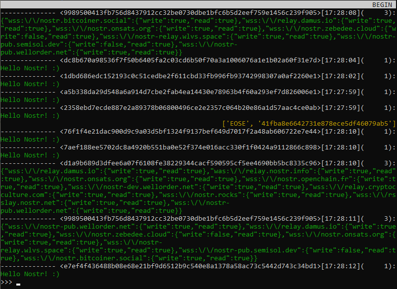

# `pynostr`

This python package aims to provide a simple interface to interact with nostr relays.

## Create and send event

```python
>>> from pynostr import event, PrvKey
>>> k = PrvKey("my 12-word secret")
>>> e = event.Event.text_note("Hello nostr !", prvkey=k)
>>> e.send_to("wss://relay.nostr.info")
['OK', 'a37138c05f7242e100be7edb7e3253916763007d2637dc0ea1a8bf81c59f1b84', True, '']
```

## Encrypt event

**NIP-04**

```python
>>> from pynostr import event, PrvKey
>>> k1 = PrvKey("first 12-word secret")
>>> k2 = PrvKey("second 12-word secret")
>>> e = event.Event(content = "Hello nostr !")
>>> e.encrypt(k1, k2.pubkey)
>>> e.content
'9w7x0XlyICBKipRizjfT6Q==?iv=2ibX4P8IbsGXez3T58QoTw=='
>>> e.kind
<EventType.ENCRYPTED_MESSAGE: 4>
>>> e.decrypt(k2)
'Hello nostr !'
```

**NIP-48 (no merged!)**

```python
>>> from pynostr import event, PrvKey
>>> k1 = PrvKey("first 12-word secret")
>>> k2 = PrvKey("second 12-word secret")
>>> k3 = PrvKey("third 12-word secret")
>>> k4 = PrvKey("fourth 12-word secret")
>>> e = event.Event(content = "Hello nostr !")
>>> e.encrypt(k1, *[k.pubkey for k in [k1, k2, k3, k4]])
>>> e.content
'ARpjIs78I+UhjPB9aOp/7w==?iv=PFtQH0Vhk6DbRivMCtl+vQ=='
>>> e.kind
<EventType.ENCRYPTED_MESSAGE: 4>
>>> for k in [k1, k2, k3, k4]:
...     print(f"{k.npub}: {e.decrypt(k)}")  
... 
npub168vqwtflnx8w42j8l5xm248c4d0u547upktx6hmgwjufnlm0kntshtzxqm: Hello nostr !
npub19j04eqd6jj4pmfd4qs5vdt6g2dlrpt2j900vfhmd2fyeejfwts3sqelxep: Hello nostr !
npub1fx2nu3ms024q7e4mwe9mvmck94r2nxvwkjwlq9axwm0e8ddgr69qmfwa5k: Hello nostr !
npub1muxxgjx2rsxgkx707t6ejr0mz8ujpv0uutpylpl024eur7y3lu8sh5y2vx: Hello nostr !
>>> e.sign(k)
>>> e.send_to("wss://relay.nostr.info")  # just for fun
['OK', 'd16bce2384b17c6b199c417c8b013f6c6a2016385af19bdf3f1f7bf0b2250483', True, '']
```

## Basic text client subscriber

```python
>>> from pynostr import client
>>> c = client.BaseThread("wss://relay.nostr.info")
>>> c.subscribe(kinds=[0, 1, 3], limit=5)
```



## Documentation

**[Read it on github](/docs)**

This doc is generated using [pydoc-markdown](
https://github.com/NiklasRosenstein/pydoc-markdown
) upon python docstring written
following [Google docstring recommendation](
    https://gist.github.com/redlotus/3bc387c2591e3e908c9b63b97b11d24e
)

## NIP implementation

<!-- https://gist.github.com/joshbuchea/6f47e86d2510bce28f8e7f42ae84c716 -->

### Client

* [x] NIP 01
* [x] NIP 04
* [x] NIP 13
* [x] NIP 19
* [x] NIP 38 (not merged)
